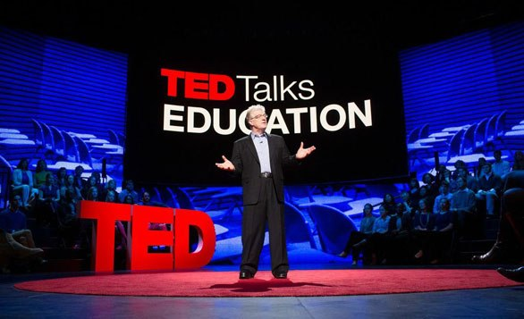

# Context

These datasets contain information all audio-video recordings of TED Talks uploaded to the official TED.com website until September 21st,2017.The TED main dataset contains information about all tasks including number of views,number of comments,descriptions,speakers and titles.The TED transcripts dataset contains the transcripts for all talks available on TED.com

# Content
There are 2 CSV files

- ted_main.csv - contains data on actual TED Talk metadata and TED Talk speakers
- transcripts.csv - contains transcript and URL information for TED Talks

Download dataset [here](https://www.kaggle.com/rounakbanik/ted-talks)

# Inspiration

I've always been fascinated by TED Talks and the immerse diversity of content that it provides for free.I was also thoroughly inspired by a TED Talk that visually explored TED Talks stats and I was motivated to do the same thing,albeit on a much less grander scale.Some of the questions that can be answered with this dataset:

- How is each TED Talk related to every other TED Talk ?
- Which are the most viewed and most favorited Talks of all time ? Are they mostly the same ? What does this tell us ?
- What kind of topics attract the maximum discussion and debate (in the form of comments) ?
- Which months are most popular among TED and TEDx chapters ?
- Which themes are most popular amongst TEDsters ?